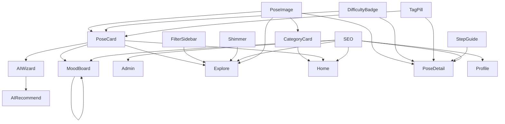

# Component Graph

This file traces the React component hierarchy and lists components that are dead or never imported.

## Component Import Hierarchy (Mermaid Diagram)

## Dead or Unused Components

Components that have an imported-by count of 0 (excluding pages / routing layout endpoints):

| Component Name | File Path |
| :--- | :--- |
| None | All components are actively imported! |
